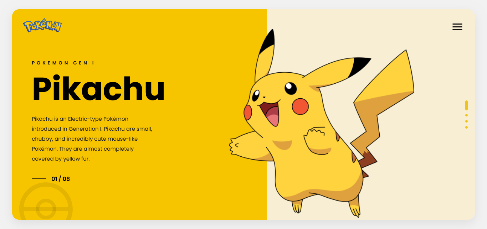

# Pikachu UI Website

A modern Pokémon inspired landing page created using HTML and CSS.

This project is focused on learning:

- Position Properties
- Absolute & Relative Positioning
- Layering using z-index
- Real UI Layout Design
- Responsive Design

---

# Preview

The website contains:

- Split screen layout
- Pikachu hero image
- Pokémon logo
- Navigation menu icon
- Custom dots navigation
- Pokeball background design

---

# Technologies Used

- HTML5
- CSS3

---

# Folder Structure

```plaintext
Assignment 1/
│
├── Preview.png
├── README.md
├── index.html
├── pngwing.com.webp
└── style.css
```

---

# Features

- Clean UI Design
- Responsive Layout
- Positioning Practice
- Modern Hero Section
- Separate HTML & CSS Files

---

# Concepts Practiced

## CSS Positioning

- position: relative
- position: absolute

## Layering

- z-index

## Responsive Design

- Media Queries

---

# How To Run

## Step 1

Download or clone the repository.

```bash
git clone https://github.com/bharat1-cloud/Cohort-3.0-Assignments/tree/85fb488d80af274aaffd7ff207670b2d3ae3eac0/Assignment%201
```

## Step 2

Open project folder.

## Step 3

Run `index.html` in browser.

---

# Learning Goal

This project was created to understand how real UI layouts are built using CSS positioning techniques.

---

# Author

Bharat Yangandul
